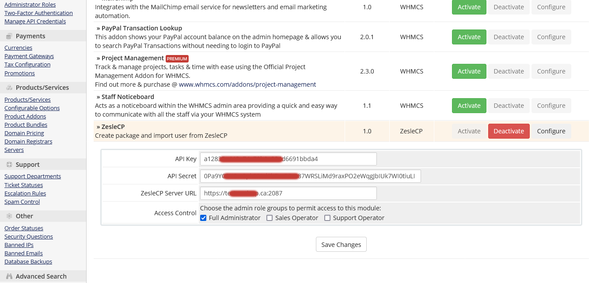

# Get your ZesleCP API Keys
1. Follow this guide to get your ZesleCP API keys https://zeslecp.com/docs/api/get-api-keys

# Addon module Installation
1. Upload folder zeslecp under /modules/addons to /<whmcs_root_path>/modules/addons/
2. Then activate addon at this url https://YOUR-WHMCS-DOMAIN/admin/configaddonmods.php and enter config value as shown in the screenshot below 

3. After that you can see activated addon output at this link  https://YOUR-WHMCS-DOMAIN/admin/addonmodules.php?module=zeslecp
check screenshot below

That's all with addon installation

# Provisioning module Installation

1. Upload folder zeslecp under /modules/servers to /<whmcs_root_path>/modules/servers/
2. Then create server group at this link https://YOUR-WHMCS-DOMAIN/admin/configservers.php?action=managegroup  check screenshot below

3. After that create server at link https://YOUR-WHMCS-DOMAIN/admin/configservers.php?action=manage and add that to the server group as shown in above screenshot, check screenshot below for this

Enter server details as show in above screenshot , **select module ZesleCP that is important**.

4. Then, create product in whmcs and associate that product with server group and ZesleCP package that will be created with in addon output screen. Check screenshot shot below for this

If product type is "Shared Hosting" then standard user will be created and if product type is "Reseller Hosting" then reseller user will be created

5. **IMPORTANT:** Create custom field with name **"ZesleCP UserID"** to store remote ZesleCP ID, check screenshot below

